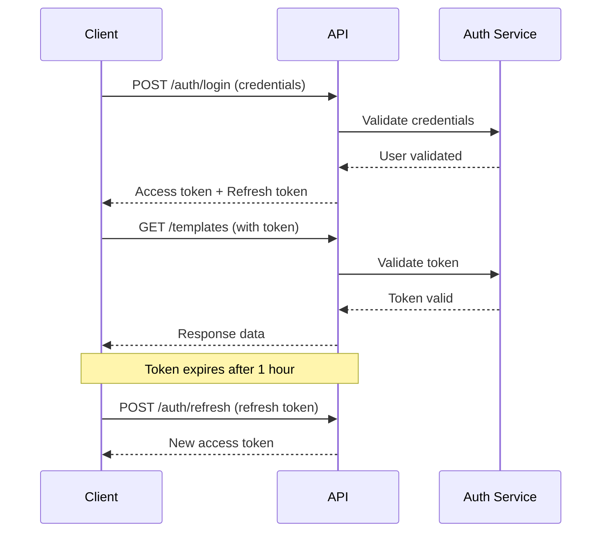

# Report Designer API Documentation
**Version:** 1.0.0  
**Base URL:** `https://api.reportdesigner.com/v1`  
**Last Updated:** January 2024

---

## Table of Contents

1. [Introduction](#introduction)
2. [Getting Started](#getting-started)
3. [Authentication](#authentication)
4. [Rate Limiting](#rate-limiting)
5. [Error Handling](#error-handling)
6. [API Endpoints](#api-endpoints)
   - [Authentication](#authentication-endpoints)
   - [Users](#users-endpoints)
   - [Templates](#templates-endpoints)
   - [Reports](#reports-endpoints)
   - [Data Sources](#data-sources-endpoints)
   - [Teams](#teams-endpoints)
   - [Analytics](#analytics-endpoints)
   - [Webhooks](#webhooks-endpoints)
7. [WebSocket Events](#websocket-events)
8. [Code Examples](#code-examples)
9. [SDKs](#sdks)
10. [Changelog](#changelog)

---

## Introduction

The Report Designer API provides programmatic access to create, manage, and generate reports using our drag-and-drop report designer platform. This RESTful API uses JSON for request and response bodies and follows standard HTTP conventions.

### Key Features
- 🔐 JWT-based authentication with refresh tokens
- 📊 RESTful design with predictable URLs
- 🚀 WebSocket support for real-time updates
- 📦 Batch operations for bulk processing
- 🔄 Webhook notifications for async events
- 📝 Comprehensive error messages
- 🌍 Multi-region support

### API Conventions

- **Timestamps**: ISO 8601 format (YYYY-MM-DDTHH:mm:ss.sssZ)
- **IDs**: UUID v4 format
- **Pagination**: Cursor-based with `limit` and `cursor` parameters
- **Filtering**: Query parameters for filtering results
- **Sorting**: `sort` parameter with field and direction
- **Versioning**: URL path versioning (/v1, /v2)

---

## Getting Started

### Quick Start

1. **Sign up** for an account at [https://reportdesigner.com](https://reportdesigner.com)
2. **Generate API credentials** from your dashboard
3. **Install SDK** or use HTTP client
4. **Make your first API call**

### Example Request

```bash
curl -X GET https://api.reportdesigner.com/v1/templates \
  -H "Authorization: Bearer YOUR_API_TOKEN" \
  -H "Content-Type: application/json"
```

### Base URLs

| Environment | Base URL |
|------------|----------|
| Production | `https://api.reportdesigner.com/v1` |
| Staging | `https://staging-api.reportdesigner.com/v1` |
| Development | `http://localhost:4000/v1` |

### Request Headers

| Header | Required | Description |
|--------|----------|-------------|
| `Authorization` | Yes | Bearer token for authentication |
| `Content-Type` | Yes | Must be `application/json` |
| `X-Request-ID` | No | Unique request identifier for tracking |
| `X-API-Version` | No | Override API version |

---

## Authentication

### Overview

The API uses JWT (JSON Web Tokens) for authentication. Tokens expire after 1 hour, and refresh tokens can be used to obtain new access tokens.

### Authentication Flow



### Token Types

| Token Type | Expiration | Usage |
|-----------|------------|--------|
| Access Token | 1 hour | API requests |
| Refresh Token | 30 days | Get new access token |
| API Key | No expiration | Server-to-server |

---

## Rate Limiting

API rate limits are enforced per user account:

| Plan | Requests/Hour | Burst Limit | Concurrent |
|------|--------------|-------------|------------|
| Free | 100 | 10/min | 2 |
| Starter | 1,000 | 100/min | 10 |
| Professional | 10,000 | 1,000/min | 50 |
| Enterprise | Unlimited | Custom | Unlimited |

### Rate Limit Headers

```http
X-RateLimit-Limit: 1000
X-RateLimit-Remaining: 999
X-RateLimit-Reset: 1640995200
X-RateLimit-Reset-After: 3600
```

### Rate Limit Response

```json
{
  "error": {
    "code": "RATE_LIMIT_EXCEEDED",
    "message": "Too many requests. Please retry after 3600 seconds.",
    "retryAfter": 3600
  }
}
```

---

## Error Handling

### Error Response Format

```json
{
  "error": {
    "code": "VALIDATION_ERROR",
    "message": "The request contains invalid parameters",
    "details": [
      {
        "field": "email",
        "code": "INVALID_FORMAT",
        "message": "Email must be a valid email address"
      }
    ],
    "requestId": "req_abc123",
    "timestamp": "2024-01-15T10:30:00.000Z"
  }
}
```

### HTTP Status Codes

| Status Code | Description |
|------------|-------------|
| `200 OK` | Successful request |
| `201 Created` | Resource created successfully |
| `204 No Content` | Successful request with no response body |
| `400 Bad Request` | Invalid request parameters |
| `401 Unauthorized` | Missing or invalid authentication |
| `403 Forbidden` | Insufficient permissions |
| `404 Not Found` | Resource not found |
| `409 Conflict` | Resource conflict (e.g., duplicate) |
| `422 Unprocessable Entity` | Validation error |
| `429 Too Many Requests` | Rate limit exceeded |
| `500 Internal Server Error` | Server error |
| `503 Service Unavailable` | Service temporarily unavailable |

### Error Codes

| Error Code | Description | Resolution |
|-----------|-------------|------------|
| `INVALID_TOKEN` | JWT token is invalid or expired | Refresh token or re-authenticate |
| `INSUFFICIENT_PERMISSIONS` | User lacks required permissions | Check user role and permissions |
| `RESOURCE_NOT_FOUND` | Requested resource doesn't exist | Verify resource ID |
| `VALIDATION_ERROR` | Request validation failed | Check request parameters |
| `DUPLICATE_RESOURCE` | Resource already exists | Use different identifier |
| `QUOTA_EXCEEDED` | Usage quota exceeded | Upgrade plan or wait |
| `INTERNAL_ERROR` | Unexpected server error | Retry request or contact support |

---

## API Endpoints

## Authentication Endpoints

### POST /auth/login
**Login with email and password**

#### Request
```json
{
  "email": "user@example.com",
  "password": "SecurePassword123!",
  "rememberMe": true
}
```

#### Response
```json
{
  "success": true,
  "data": {
    "accessToken": "eyJhbGciOiJIUzI1NiIs...",
    "refreshToken": "eyJhbGciOiJIUzI1NiIs...",
    "expiresIn": 3600,
    "user": {
      "id": "usr_abc123",
      "email": "user@example.com",
      "name": "John Doe",
      "role": "designer",
      "avatar": "https://cdn.example.com/avatar.jpg"
    }
  }
}
```

### POST /auth/refresh
**Refresh access token**

#### Request
```json
{
  "refreshToken": "eyJhbGciOiJIUzI1NiIs..."
}
```

#### Response
```json
{
  "success": true,
  "data": {
    "accessToken": "eyJhbGciOiJIUzI1NiIs...",
    "expiresIn": 3600
  }
}
```

### POST /auth/logout
**Logout and invalidate tokens**

#### Request
```json
{
  "refreshToken": "eyJhbGciOiJIUzI1NiIs..."
}
```

#### Response
```json
{
  "success": true,
  "message": "Successfully logged out"
}
```

### POST /auth/register
**Register new account**

#### Request
```json
{
  "email": "newuser@example.com",
  "password": "SecurePassword123!",
  "name": "Jane Doe",
  "company": "ACME Corp",
  "acceptTerms": true
}
```

#### Response
```json
{
  "success": true,
  "data": {
    "user": {
      "id": "usr_def456",
      "email": "newuser@example.com",
      "name": "Jane Doe",
      "emailVerified": false
    },
    "message": "Verification email sent"
  }
}
```

### POST /auth/forgot-password
**Request password reset**

#### Request
```json
{
  "email": "user@example.com"
}
```

#### Response
```json
{
  "success": true,
  "message": "Password reset email sent if account exists"
}
```

### POST /auth/reset-password
**Reset password with token**

#### Request
```json
{
  "token": "reset_token_abc123",
  "password": "NewSecurePassword123!"
}
```

#### Response
```json
{
  "success": true,
  "message": "Password successfully reset"
}
```

---

## Users Endpoints

### GET /users/me
**Get current user profile**

#### Response
```json
{
  "success": true,
  "data": {
    "id": "usr_abc123",
    "email": "user@example.com",
    "name": "John Doe",
    "role": "designer",
    "avatar": "https://cdn.example.com/avatar.jpg",
    "company": "ACME Corp",
    "timezone": "America/New_York",
    "language": "en",
    "emailVerified": true,
    "twoFactorEnabled": false,
    "createdAt": "2024-01-01T00:00:00.000Z",
    "updatedAt": "2024-01-15T10:30:00.000Z",
    "subscription": {
      "plan": "professional",
      "status": "active",
      "expiresAt": "2024-12-31T23:59:59.000Z"
    },
    "quotas": {
      "templates": {
        "used": 45,
        "limit": 100
      },
      "reports": {
        "used": 234,
        "limit": 5000,
        "period": "monthly"
      },
      "storage": {
        "used": 1073741824,
        "limit": 10737418240
      }
    }
  }
}
```

### PATCH /users/me
**Update current user profile**

#### Request
```json
{
  "name": "John Smith",
  "timezone": "Europe/London",
  "language": "en-GB",
  "notifications": {
    "email": true,
    "reportComplete": true,
    "weeklyDigest": false
  }
}
```

#### Response
```json
{
  "success": true,
  "data": {
    "id": "usr_abc123",
    "name": "John Smith",
    "timezone": "Europe/London",
    "language": "en-GB",
    "updatedAt": "2024-01-15T11:00:00.000Z"
  }
}
```

### POST /users/avatar
**Upload user avatar**

#### Request
```http
POST /users/avatar
Content-Type: multipart/form-data

------WebKitFormBoundary
Content-Disposition: form-data; name="avatar"; filename="avatar.jpg"
Content-Type: image/jpeg

[Binary data]
------WebKitFormBoundary--
```

#### Response
```json
{
  "success": true,
  "data": {
    "avatarUrl": "https://cdn.example.com/avatars/usr_abc123.jpg"
  }
}
```

### DELETE /users/me
**Delete user account**

#### Request
```json
{
  "password": "CurrentPassword123!",
  "reason": "No longer needed",
  "feedback": "Optional feedback"
}
```

#### Response
```json
{
  "success": true,
  "message": "Account scheduled for deletion in 30 days"
}
```

---

## Templates Endpoints

### GET /templates
**List templates**

#### Query Parameters
| Parameter | Type | Description | Default |
|-----------|------|-------------|---------|
| `limit` | integer | Number of results | 20 |
| `cursor` | string | Pagination cursor | null |
| `category` | string | Filter by category | all |
| `search` | string | Search in name/description | null |
| `sort` | string | Sort field and direction | createdAt:desc |
| `isPublic` | boolean | Public templates only | false |
| `authorId` | string | Filter by author | null |

#### Response
```json
{
  "success": true,
  "data": [
    {
      "id": "tpl_abc123",
      "name": "Monthly Sales Report",
      "description": "Professional sales report template",
      "category": "sales",
      "thumbnail": "https://cdn.example.com/thumbnails/tpl_abc123.png",
      "isPublic": true,
      "version": 2,
      "author": {
        "id": "usr_abc123",
        "name": "John Doe",
        "avatar": "https://cdn.example.com/avatar.jpg"
      },
      "stats": {
        "uses": 156,
        "likes": 43,
        "rating": 4.5
      },
      "tags": ["sales", "monthly", "professional"],
      "createdAt": "2024-01-01T00:00:00.000Z",
      "updatedAt": "2024-01-10T15:30:00.000Z"
    }
  ],
  "pagination": {
    "hasMore": true,
    "nextCursor": "eyJpZCI6InRwbF9hYmMxMjMifQ=="
  }
}
```

### GET /templates/:id
**Get template by ID**

#### Response
```json
{
  "success": true,
  "data": {
    "id": "tpl_abc123",
    "name": "Monthly Sales Report",
    "description": "Professional sales report template with charts",
    "category": "sales",
    "content": {
      "html": "<div class=\"report\">{{#each items}}...</div>",
      "css": ".report { font-family: Arial; }",
      "components": [
        {
          "id": "comp_header",
          "type": "header",
          "props": {
            "title": "{{reportTitle}}",
            "subtitle": "{{reportDate}}"
          }
        }
      ],
      "dataBindings": [
        {
          "field": "items",
          "source": "query.salesData",
          "transform": "groupByMonth"
        }
      ],
      "helpers": [
        {
          "name": "formatCurrency",
          "function": "function(value) { return '$' + value.toFixed(2); }"
        }
      ]
    },
    "settings": {
      "pageSize": "A4",
      "orientation": "portrait",
      "margins": {
        "top": 20,
        "right": 20,
        "bottom": 20,
        "left": 20
      },
      "headerTemplate": "<div>Page {{page}} of {{pages}}</div>",
      "footerTemplate": "<div>© 2024 Company Name</div>"
    },
    "permissions": {
      "canEdit": true,
      "canDelete": true,
      "canShare": true,
      "canDuplicate": true
    },
    "version": 2,
    "versions": [
      {
        "version": 1,
        "createdAt": "2024-01-01T00:00:00.000Z",
        "changelog": "Initial version"
      },
      {
        "version": 2,
        "createdAt": "2024-01-10T15:30:00.000Z",
        "changelog": "Added chart components"
      }
    ]
  }
}
```

### POST /templates
**Create new template**

#### Request
```json
{
  "name": "Quarterly Report",
  "description": "Comprehensive quarterly business report",
  "category": "business",
  "isPublic": false,
  "content": {
    "html": "<div class=\"report\">{{content}}</div>",
    "css": ".report { font-family: Arial; }",
    "components": [
      {
        "type": "text",
        "props": {
          "content": "Quarterly Report"
        }
      }
    ]
  },
  "settings": {
    "pageSize": "A4",
    "orientation": "portrait"
  },
  "tags": ["quarterly", "business", "comprehensive"]
}
```

#### Response
```json
{
  "success": true,
  "data": {
    "id": "tpl_def456",
    "name": "Quarterly Report",
    "version": 1,
    "createdAt": "2024-01-15T12:00:00.000Z"
  }
}
```

### PUT /templates/:id
**Update template**

#### Request
```json
{
  "name": "Updated Quarterly Report",
  "description": "Enhanced quarterly report with new features",
  "content": {
    "html": "<div class=\"report enhanced\">{{content}}</div>",
    "css": ".report.enhanced { font-family: 'Helvetica Neue'; }"
  },
  "changelog": "Added enhanced styling and new data visualizations"
}
```

#### Response
```json
{
  "success": true,
  "data": {
    "id": "tpl_def456",
    "name": "Updated Quarterly Report",
    "version": 2,
    "updatedAt": "2024-01-15T13:00:00.000Z"
  }
}
```

### DELETE /templates/:id
**Delete template**

#### Response
```json
{
  "success": true,
  "message": "Template deleted successfully"
}
```

### POST /templates/:id/duplicate
**Duplicate template**

#### Request
```json
{
  "name": "Copy of Monthly Sales Report",
  "description": "Duplicated template for customization"
}
```

#### Response
```json
{
  "success": true,
  "data": {
    "id": "tpl_ghi789",
    "name": "Copy of Monthly Sales Report",
    "originalId": "tpl_abc123",
    "createdAt": "2024-01-15T14:00:00.000Z"
  }
}
```

### POST /templates/:id/share
**Share template**

#### Request
```json
{
  "recipients": [
    {
      "email": "colleague@example.com",
      "permission": "view"
    },
    {
      "email": "editor@example.com",
      "permission": "edit"
    }
  ],
  "message": "Check out this template",
  "expiresAt": "2024-02-15T00:00:00.000Z"
}
```

#### Response
```json
{
  "success": true,
  "data": {
    "shareId": "shr_abc123",
    "shareUrl": "https://app.reportdesigner.com/shared/shr_abc123",
    "recipients": 2,
    "expiresAt": "2024-02-15T00:00:00.000Z"
  }
}
```

---

## Reports Endpoints

### GET /reports
**List generated reports**

#### Query Parameters
| Parameter | Type | Description | Default |
|-----------|------|-------------|---------|
| `limit` | integer | Number of results | 20 |
| `cursor` | string | Pagination cursor | null |
| `status` | string | Filter by status | all |
| `templateId` | string | Filter by template | null |
| `startDate` | string | Filter by date range start | null |
| `endDate` | string | Filter by date range end | null |

#### Response
```json
{
  "success": true,
  "data": [
    {
      "id": "rpt_abc123",
      "name": "Q4 2023 Sales Report",
      "templateId": "tpl_abc123",
      "templateName": "Monthly Sales Report",
      "status": "completed",
      "format": "pdf",
      "fileSize": 2457600,
      "pageCount": 12,
      "downloadUrl": "https://cdn.example.com/reports/rpt_abc123.pdf",
      "expiresAt": "2024-01-22T12:00:00.000Z",
      "generatedAt": "2024-01-15T12:00:00.000Z",
      "metadata": {
        "quarter": "Q4",
        "year": 2023,
        "department": "Sales"
      }
    }
  ],
  "pagination": {
    "hasMore": false,
    "nextCursor": null
  }
}
```

### GET /reports/:id
**Get report details**

#### Response
```json
{
  "success": true,
  "data": {
    "id": "rpt_abc123",
    "name": "Q4 2023 Sales Report",
    "templateId": "tpl_abc123",
    "template": {
      "id": "tpl_abc123",
      "name": "Monthly Sales Report",
      "version": 2
    },
    "status": "completed",
    "format": "pdf",
    "fileSize": 2457600,
    "pageCount": 12,
    "downloadUrl": "https://cdn.example.com/reports/rpt_abc123.pdf",
    "thumbnails": [
      "https://cdn.example.com/thumbnails/rpt_abc123_page1.jpg",
      "https://cdn.example.com/thumbnails/rpt_abc123_page2.jpg"
    ],
    "dataSource": {
      "type": "sql",
      "query": "SELECT * FROM sales WHERE quarter = 'Q4'",
      "executedAt": "2024-01-15T11:59:30.000Z"
    },
    "generationTime": 4.5,
    "generatedAt": "2024-01-15T12:00:00.000Z",
    "expiresAt": "2024-01-22T12:00:00.000Z",
    "metadata": {
      "quarter": "Q4",
      "year": 2023,
      "department": "Sales",
      "generatedBy": "usr_abc123"
    }
  }
}
```

### POST /reports/generate
**Generate new report**

#### Request
```json
{
  "templateId": "tpl_abc123",
  "name": "January 2024 Sales Report",
  "format": "pdf",
  "data": {
    "reportTitle": "January 2024 Sales",
    "items": [
      {
        "product": "Widget A",
        "quantity": 100,
        "revenue": 5000
      },
      {
        "product": "Widget B",
        "quantity": 75,
        "revenue": 3750
      }
    ]
  },
  "dataSource": {
    "type": "manual",
    "data": {}
  },
  "settings": {
    "pageSize": "A4",
    "orientation": "portrait",
    "quality": "high"
  },
  "async": true,
  "webhookUrl": "https://example.com/webhook",
  "metadata": {
    "month": "January",
    "year": 2024
  }
}
```

#### Response (Async)
```json
{
  "success": true,
  "data": {
    "jobId": "job_abc123",
    "status": "queued",
    "estimatedTime": 10,
    "position": 3,
    "statusUrl": "https://api.reportdesigner.com/v1/reports/jobs/job_abc123"
  }
}
```

#### Response (Sync)
```json
{
  "success": true,
  "data": {
    "id": "rpt_def456",
    "status": "completed",
    "downloadUrl": "https://cdn.example.com/reports/rpt_def456.pdf",
    "fileSize": 1548576,
    "pageCount": 8,
    "generationTime": 3.2
  }
}
```

### POST /reports/batch
**Generate multiple reports**

#### Request
```json
{
  "templateId": "tpl_abc123",
  "format": "pdf",
  "reports": [
    {
      "name": "Report for Client A",
      "data": {
        "clientName": "Client A",
        "revenue": 50000
      }
    },
    {
      "name": "Report for Client B",
      "data": {
        "clientName": "Client B",
        "revenue": 75000
      }
    }
  ],
  "settings": {
    "parallel": true,
    "maxConcurrent": 5
  }
}
```

#### Response
```json
{
  "success": true,
  "data": {
    "batchId": "batch_abc123",
    "totalReports": 2,
    "status": "processing",
    "statusUrl": "https://api.reportdesigner.com/v1/reports/batch/batch_abc123"
  }
}
```

### GET /reports/jobs/:jobId
**Get report generation job status**

#### Response
```json
{
  "success": true,
  "data": {
    "jobId": "job_abc123",
    "status": "processing",
    "progress": 45,
    "currentStep": "Generating PDF",
    "steps": [
      {
        "name": "Fetching template",
        "status": "completed",
        "duration": 0.5
      },
      {
        "name": "Processing data",
        "status": "completed",
        "duration": 1.2
      },
      {
        "name": "Generating PDF",
        "status": "processing",
        "progress": 45
      }
    ],
    "estimatedTimeRemaining": 5
  }
}
```

### DELETE /reports/:id
**Delete report**

#### Response
```json
{
  "success": true,
  "message": "Report deleted successfully"
}
```

---

## Data Sources Endpoints

### GET /data-sources
**List data sources**

#### Response
```json
{
  "success": true,
  "data": [
    {
      "id": "ds_abc123",
      "name": "Production Database",
      "type": "postgresql",
      "status": "connected",
      "lastConnected": "2024-01-15T10:00:00.000Z",
      "config": {
        "host": "db.example.com",
        "port": 5432,
        "database": "production",
        "ssl": true
      },
      "permissions": {
        "canEdit": true,
        "canDelete": false,
        "canTest": true
      }
    },
    {
      "id": "ds_def456",
      "name": "Sales API",
      "type": "rest_api",
      "status": "connected",
      "lastConnected": "2024-01-15T11:00:00.000Z",
      "config": {
        "baseUrl": "https://api.sales.example.com",
        "authType": "bearer",
        "headers": {
          "X-API-Version": "2.0"
        }
      }
    }
  ]
}
```

### GET /data-sources/:id
**Get data source details**

#### Response
```json
{
  "success": true,
  "data": {
    "id": "ds_abc123",
    "name": "Production Database",
    "type": "postgresql",
    "status": "connected",
    "config": {
      "host": "db.example.com",
      "port": 5432,
      "database": "production",
      "username": "readonly_user",
      "ssl": true,
      "poolSize": 10
    },
    "schema": {
      "tables": [
        {
          "name": "customers",
          "columns": [
            {
              "name": "id",
              "type": "integer",
              "nullable": false,
              "primaryKey": true
            },
            {
              "name": "name",
              "type": "varchar(255)",
              "nullable": false
            },
            {
              "name": "email",
              "type": "varchar(255)",
              "nullable": false
            }
          ]
        }
      ]
    },
    "statistics": {
      "totalQueries": 1543,
      "avgResponseTime": 125,
      "lastError": null
    },
    "createdAt": "2024-01-01T00:00:00.000Z",
    "updatedAt": "2024-01-10T15:30:00.000Z"
  }
}
```

### POST /data-sources
**Create data source**

#### Request
```json
{
  "name": "Analytics Database",
  "type": "mysql",
  "config": {
    "host": "analytics.example.com",
    "port": 3306,
    "database": "analytics",
    "username": "report_user",
    "password": "encrypted_password",
    "ssl": true
  }
}
```

#### Response
```json
{
  "success": true,
  "data": {
    "id": "ds_ghi789",
    "name": "Analytics Database",
    "status": "pending",
    "message": "Testing connection..."
  }
}
```

### POST /data-sources/:id/test
**Test data source connection**

#### Response
```json
{
  "success": true,
  "data": {
    "status": "connected",
    "responseTime": 145,
    "message": "Connection successful",
    "details": {
      "version": "MySQL 8.0.32",
      "timezone": "UTC",
      "maxConnections": 100
    }
  }
}
```

### POST /data-sources/:id/query
**Execute query on data source**

#### Request
```json
{
  "query": "SELECT * FROM customers WHERE created_at > '2024-01-01' LIMIT 10",
  "parameters": {},
  "timeout": 30000
}
```

#### Response
```json
{
  "success": true,
  "data": {
    "columns": [
      {
        "name": "id",
        "type": "integer"
      },
      {
        "name": "name",
        "type": "string"
      },
      {
        "name": "email",
        "type": "string"
      }
    ],
    "rows": [
      {
        "id": 1,
        "name": "John Doe",
        "email": "john@example.com"
      },
      {
        "id": 2,
        "name": "Jane Smith",
        "email": "jane@example.com"
      }
    ],
    "rowCount": 2,
    "executionTime": 125
  }
}
```

### DELETE /data-sources/:id
**Delete data source**

#### Response
```json
{
  "success": true,
  "message": "Data source deleted successfully"
}
```

---

## Teams Endpoints

### GET /teams
**List teams**

#### Response
```json
{
  "success": true,
  "data": [
    {
      "id": "team_abc123",
      "name": "Marketing Team",
      "description": "Marketing department team",
      "memberCount": 8,
      "role": "admin",
      "permissions": [
        "manage_members",
        "manage_templates",
        "manage_reports"
      ],
      "createdAt": "2024-01-01T00:00:00.000Z"
    }
  ]
}
```

### GET /teams/:id
**Get team details**

#### Response
```json
{
  "success": true,
  "data": {
    "id": "team_abc123",
    "name": "Marketing Team",
    "description": "Marketing department team",
    "members": [
      {
        "id": "usr_abc123",
        "name": "John Doe",
        "email": "john@example.com",
        "role": "admin",
        "joinedAt": "2024-01-01T00:00:00.000Z"
      },
      {
        "id": "usr_def456",
        "name": "Jane Smith",
        "email": "jane@example.com",
        "role": "member",
        "joinedAt": "2024-01-05T00:00:00.000Z"
      }
    ],
    "settings": {
      "defaultTemplateAccess": "view",
      "reportRetention": 90,
      "autoShareReports": true
    },
    "quotas": {
      "templates": {
        "used": 25,
        "limit": 100
      },
      "reports": {
        "used": 450,
        "limit": 1000
      }
    }
  }
}
```

### POST /teams
**Create team**

#### Request
```json
{
  "name": "Sales Team",
  "description": "Sales department team",
  "members": [
    {
      "email": "member1@example.com",
      "role": "member"
    },
    {
      "email": "member2@example.com",
      "role": "viewer"
    }
  ]
}
```

#### Response
```json
{
  "success": true,
  "data": {
    "id": "team_def456",
    "name": "Sales Team",
    "invitesSent": 2
  }
}
```

### POST /teams/:id/members
**Add team member**

#### Request
```json
{
  "email": "newmember@example.com",
  "role": "member",
  "sendInvite": true
}
```

#### Response
```json
{
  "success": true,
  "data": {
    "memberId": "mem_abc123",
    "status": "invited"
  }
}
```

### DELETE /teams/:id/members/:memberId
**Remove team member**

#### Response
```json
{
  "success": true,
  "message": "Member removed successfully"
}
```

---

## Analytics Endpoints

### GET /analytics/overview
**Get analytics overview**

#### Query Parameters
| Parameter | Type | Description | Default |
|-----------|------|-------------|---------|
| `startDate` | string | Start date (ISO 8601) | 30 days ago |
| `endDate` | string | End date (ISO 8601) | today |
| `timezone` | string | Timezone for aggregation | UTC |

#### Response
```json
{
  "success": true,
  "data": {
    "period": {
      "start": "2024-01-01T00:00:00.000Z",
      "end": "2024-01-31T23:59:59.000Z"
    },
    "summary": {
      "totalReports": 543,
      "totalTemplates": 23,
      "activeUsers": 15,
      "avgGenerationTime": 3.5,
      "successRate": 98.5
    },
    "trends": {
      "reports": [
        {
          "date": "2024-01-01",
          "count": 15
        },
        {
          "date": "2024-01-02",
          "count": 22
        }
      ],
      "users": [
        {
          "date": "2024-01-01",
          "count": 8
        },
        {
          "date": "2024-01-02",
          "count": 10
        }
      ]
    },
    "topTemplates": [
      {
        "id": "tpl_abc123",
        "name": "Monthly Sales Report",
        "uses": 125
      }
    ],
    "topUsers": [
      {
        "id": "usr_abc123",
        "name": "John Doe",
        "reports": 89
      }
    ]
  }
}
```

### GET /analytics/reports
**Get report analytics**

#### Response
```json
{
  "success": true,
  "data": {
    "totalGenerated": 1543,
    "byFormat": {
      "pdf": 1200,
      "excel": 250,
      "html": 93
    },
    "byStatus": {
      "completed": 1520,
      "failed": 23
    },
    "avgGenerationTime": 3.5,
    "peakHours": [
      {
        "hour": 9,
        "count": 145
      },
      {
        "hour": 14,
        "count": 132
      }
    ],
    "errorRate": 1.49,
    "commonErrors": [
      {
        "code": "TIMEOUT",
        "count": 12,
        "percentage": 52.2
      }
    ]
  }
}
```

---

## Webhooks Endpoints

### GET /webhooks
**List webhooks**

#### Response
```json
{
  "success": true,
  "data": [
    {
      "id": "whk_abc123",
      "url": "https://example.com/webhook",
      "events": [
        "report.generated",
        "report.failed"
      ],
      "active": true,
      "secret": "whsec_abc123...",
      "lastTriggered": "2024-01-15T10:00:00.000Z",
      "createdAt": "2024-01-01T00:00:00.000Z"
    }
  ]
}
```

### POST /webhooks
**Create webhook**

#### Request
```json
{
  "url": "https://example.com/webhook",
  "events": [
    "report.generated",
    "report.failed",
    "template.created",
    "template.updated"
  ],
  "description": "Production webhook",
  "active": true
}
```

#### Response
```json
{
  "success": true,
  "data": {
    "id": "whk_def456",
    "url": "https://example.com/webhook",
    "secret": "whsec_def456xyz789",
    "events": [
      "report.generated",
      "report.failed",
      "template.created",
      "template.updated"
    ]
  }
}
```

### POST /webhooks/:id/test
**Test webhook**

#### Response
```json
{
  "success": true,
  "data": {
    "status": "success",
    "statusCode": 200,
    "responseTime": 245,
    "response": {
      "message": "Webhook received"
    }
  }
}
```

### DELETE /webhooks/:id
**Delete webhook**

#### Response
```json
{
  "success": true,
  "message": "Webhook deleted successfully"
}
```

---

## WebSocket Events

### Connection

```javascript
const ws = new WebSocket('wss://api.reportdesigner.com/v1/ws');

ws.onopen = () => {
  // Authenticate
  ws.send(JSON.stringify({
    type: 'auth',
    token: 'your_jwt_token'
  }));
};
```

### Event Types

#### Template Events
```json
{
  "type": "template.updated",
  "data": {
    "templateId": "tpl_abc123",
    "userId": "usr_def456",
    "changes": {
      "name": "Updated Template Name"
    },
    "timestamp": "2024-01-15T10:00:00.000Z"
  }
}
```

#### Report Events
```json
{
  "type": "report.progress",
  "data": {
    "jobId": "job_abc123",
    "progress": 75,
    "currentStep": "Generating PDF",
    "estimatedTimeRemaining": 5
  }
}
```

```json
{
  "type": "report.completed",
  "data": {
    "reportId": "rpt_abc123",
    "downloadUrl": "https://cdn.example.com/reports/rpt_abc123.pdf",
    "pageCount": 12,
    "generationTime": 4.5
  }
}
```

#### Collaboration Events
```json
{
  "type": "collaboration.user_joined",
  "data": {
    "templateId": "tpl_abc123",
    "user": {
      "id": "usr_def456",
      "name": "Jane Smith",
      "avatar": "https://cdn.example.com/avatar.jpg"
    }
  }
}
```

```json
{
  "type": "collaboration.component_changed",
  "data": {
    "templateId": "tpl_abc123",
    "componentId": "comp_header",
    "changes": {
      "props": {
        "title": "New Title"
      }
    },
    "userId": "usr_def456"
  }
}
```

---

## Code Examples

### JavaScript/Node.js

```javascript
// Installation
// npm install @reportdesigner/sdk axios

const ReportDesigner = require('@reportdesigner/sdk');

// Initialize client
const client = new ReportDesigner({
  apiKey: 'YOUR_API_KEY',
  baseUrl: 'https://api.reportdesigner.com/v1'
});

// List templates
async function listTemplates() {
  try {
    const templates = await client.templates.list({
      limit: 10,
      category: 'sales'
    });
    console.log(templates);
  } catch (error) {
    console.error('Error:', error.message);
  }
}

// Generate report
async function generateReport() {
  try {
    const report = await client.reports.generate({
      templateId: 'tpl_abc123',
      format: 'pdf',
      data: {
        title: 'Monthly Report',
        items: [
          { name: 'Product A', value: 1000 },
          { name: 'Product B', value: 2000 }
        ]
      }
    });
    
    console.log('Report URL:', report.downloadUrl);
  } catch (error) {
    console.error('Error:', error.message);
  }
}

// WebSocket connection
function connectWebSocket() {
  const ws = client.ws.connect();
  
  ws.on('report.completed', (data) => {
    console.log('Report completed:', data.reportId);
  });
  
  ws.on('error', (error) => {
    console.error('WebSocket error:', error);
  });
}
```

### Python

```python
# Installation
# pip install reportdesigner-sdk

from reportdesigner import Client
from reportdesigner.exceptions import ReportDesignerError

# Initialize client
client = Client(
    api_key='YOUR_API_KEY',
    base_url='https://api.reportdesigner.com/v1'
)

# List templates
def list_templates():
    try:
        templates = client.templates.list(
            limit=10,
            category='sales'
        )
        for template in templates['data']:
            print(f"{template['id']}: {template['name']}")
    except ReportDesignerError as e:
        print(f"Error: {e}")

# Generate report
def generate_report():
    try:
        report = client.reports.generate(
            template_id='tpl_abc123',
            format='pdf',
            data={
                'title': 'Monthly Report',
                'items': [
                    {'name': 'Product A', 'value': 1000},
                    {'name': 'Product B', 'value': 2000}
                ]
            },
            async_mode=True
        )
        
        # Wait for completion
        result = client.reports.wait_for_completion(report['jobId'])
        print(f"Report URL: {result['downloadUrl']}")
        
    except ReportDesignerError as e:
        print(f"Error: {e}")

# Batch generation
def batch_generate():
    reports = []
    for i in range(10):
        reports.append({
            'name': f'Report {i}',
            'data': {'index': i}
        })
    
    batch = client.reports.batch_generate(
        template_id='tpl_abc123',
        reports=reports
    )
    
    print(f"Batch ID: {batch['batchId']}")
```

### PHP

```php
<?php
// Installation
// composer require reportdesigner/sdk

use ReportDesigner\Client;
use ReportDesigner\Exception\ApiException;

// Initialize client
$client = new Client([
    'apiKey' => 'YOUR_API_KEY',
    'baseUrl' => 'https://api.reportdesigner.com/v1'
]);

// List templates
try {
    $templates = $client->templates->list([
        'limit' => 10,
        'category' => 'sales'
    ]);
    
    foreach ($templates['data'] as $template) {
        echo $template['id'] . ': ' . $template['name'] . PHP_EOL;
    }
} catch (ApiException $e) {
    echo 'Error: ' . $e->getMessage();
}

// Generate report
try {
    $report = $client->reports->generate([
        'templateId' => 'tpl_abc123',
        'format' => 'pdf',
        'data' => [
            'title' => 'Monthly Report',
            'items' => [
                ['name' => 'Product A', 'value' => 1000],
                ['name' => 'Product B', 'value' => 2000]
            ]
        ]
    ]);
    
    echo 'Report URL: ' . $report['downloadUrl'];
} catch (ApiException $e) {
    echo 'Error: ' . $e->getMessage();
}
```

### cURL

```bash
# List templates
curl -X GET "https://api.reportdesigner.com/v1/templates?limit=10&category=sales" \
  -H "Authorization: Bearer YOUR_API_TOKEN" \
  -H "Content-Type: application/json"

# Create template
curl -X POST "https://api.reportdesigner.com/v1/templates" \
  -H "Authorization: Bearer YOUR_API_TOKEN" \
  -H "Content-Type: application/json" \
  -d '{
    "name": "New Template",
    "description": "Template description",
    "content": {
      "html": "<div>{{content}}</div>",
      "css": "div { font-family: Arial; }"
    }
  }'

# Generate report
curl -X POST "https://api.reportdesigner.com/v1/reports/generate" \
  -H "Authorization: Bearer YOUR_API_TOKEN" \
  -H "Content-Type: application/json" \
  -d '{
    "templateId": "tpl_abc123",
    "format": "pdf",
    "data": {
      "title": "Report Title",
      "content": "Report content"
    }
  }'

# Check job status
curl -X GET "https://api.reportdesigner.com/v1/reports/jobs/job_abc123" \
  -H "Authorization: Bearer YOUR_API_TOKEN"
```

---

## SDKs

Official SDKs are available for the following languages:

| Language | Package | Documentation |
|----------|---------|---------------|
| JavaScript/Node.js | `@reportdesigner/sdk` | [npm](https://npmjs.com/package/@reportdesigner/sdk) |
| Python | `reportdesigner-sdk` | [PyPI](https://pypi.org/project/reportdesigner-sdk) |
| PHP | `reportdesigner/sdk` | [Packagist](https://packagist.org/packages/reportdesigner/sdk) |
| Ruby | `reportdesigner` | [RubyGems](https://rubygems.org/gems/reportdesigner) |
| Go | `github.com/reportdesigner/go-sdk` | [GitHub](https://github.com/reportdesigner/go-sdk) |
| Java | `com.reportdesigner:sdk` | [Maven](https://mvnrepository.com/artifact/com.reportdesigner/sdk) |
| .NET | `ReportDesigner.SDK` | [NuGet](https://www.nuget.org/packages/ReportDesigner.SDK) |

### SDK Features

- **Auto-retry**: Automatic retry with exponential backoff
- **Rate limiting**: Built-in rate limit handling
- **Caching**: Response caching for better performance
- **Validation**: Request validation before sending
- **Type safety**: Full TypeScript/type definitions
- **Async support**: Promise-based and async/await support
- **WebSocket**: Real-time event handling
- **File uploads**: Multipart form data support

---

## Changelog

### Version 1.0.0 (2024-01-15)
- Initial API release
- Template management endpoints
- Report generation with PDF support
- Data source connections
- Team collaboration features
- WebSocket real-time updates
- Webhook notifications
- Analytics endpoints

### Version 0.9.0 (2023-12-01)
- Beta release
- Core functionality
- Limited to 100 beta users

---

## Support

### Resources
- **Documentation**: https://docs.reportdesigner.com
- **API Status**: https://status.reportdesigner.com
- **Support Portal**: https://support.reportdesigner.com
- **Community Forum**: https://community.reportdesigner.com

### Contact
- **Email**: api-support@reportdesigner.com
- **Discord**: https://discord.gg/reportdesigner
- **GitHub**: https://github.com/reportdesigner

### SLA
| Plan | Response Time | Uptime |
|------|--------------|--------|
| Free | Best effort | 99% |
| Starter | 24 hours | 99.5% |
| Professional | 4 hours | 99.9% |
| Enterprise | 1 hour | 99.99% |

---

## License

This API is provided under the [ReportDesigner API Terms of Service](https://reportdesigner.com/terms).

© 2024 ReportDesigner. All rights reserved.