# Data Flow Diagrams
## Drag-and-Drop Report Designer Application

---

## 1. System Context Diagram (Level 0)

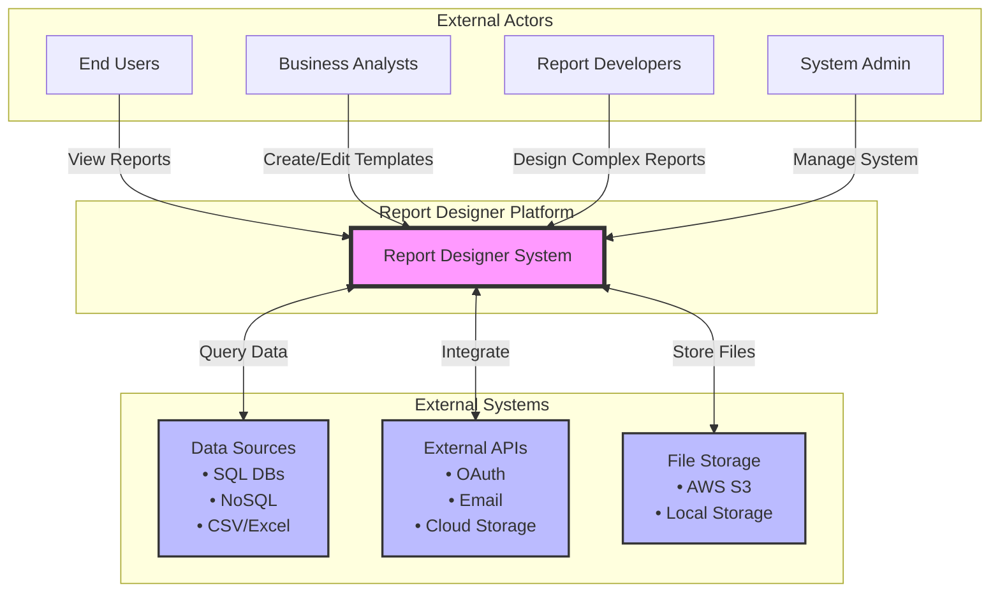

---

## 2. Level 1 - Core System Processes

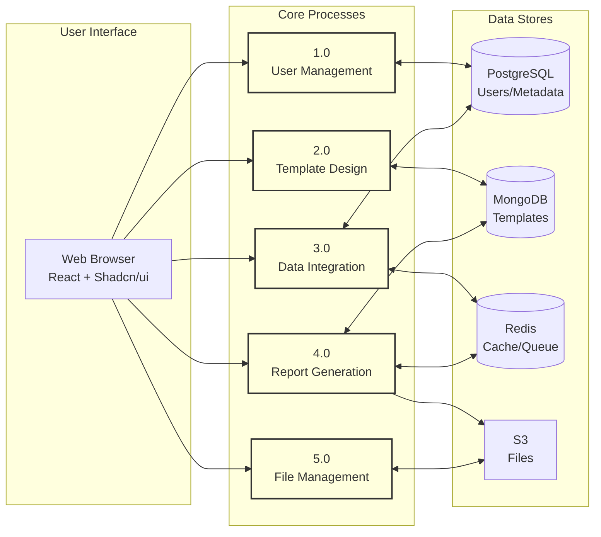

---

## 3. Authentication & Authorization Flow

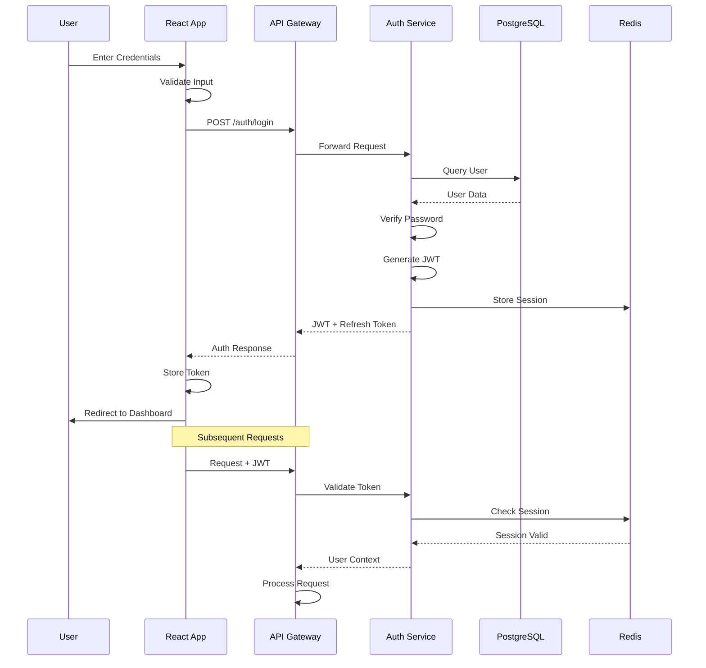

---

## 4. Template Design Data Flow

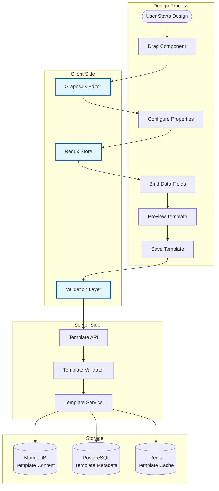

---

## 5. Data Source Connection Flow

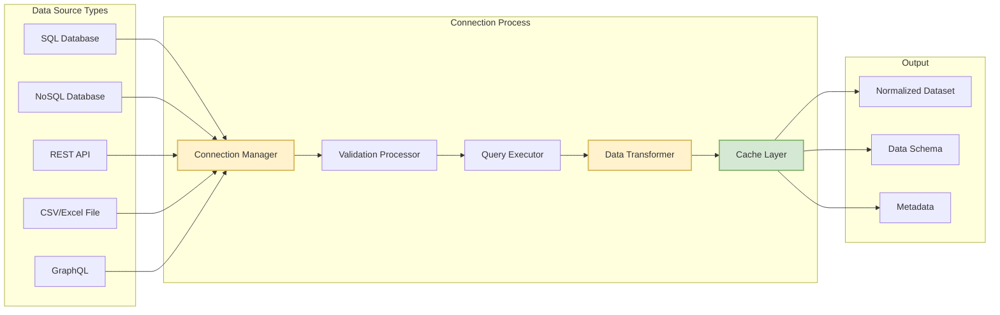

---

## 6. Report Generation Pipeline

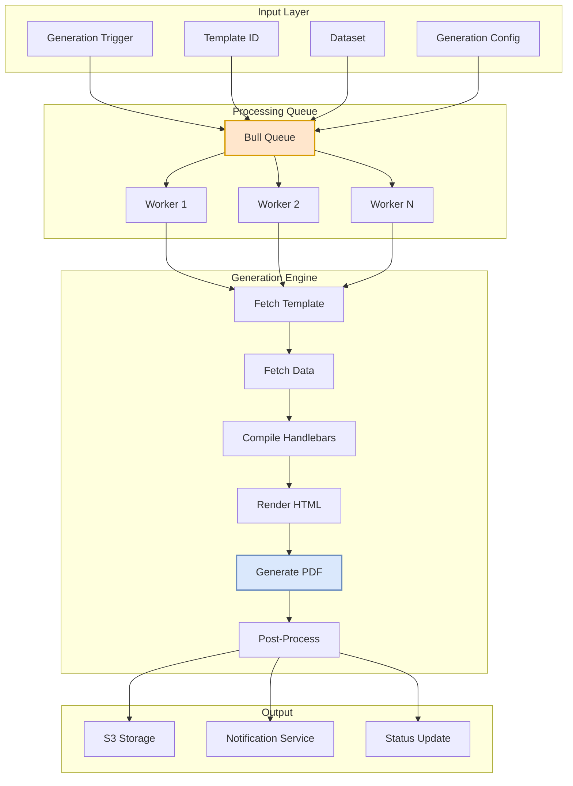

---

## 7. Level 2 - Report Generation Detailed Flow

```mermaid
graph TB
    subgraph "2.1 Request Validation"
        RV1[Check User Permissions]
        RV2[Validate Template ID]
        RV3[Validate Data Source]
        RV4[Check Quotas]
    end
    
    subgraph "2.2 Data Preparation"
        DP1[Connect to Data Source]
        DP2[Execute Query]
        DP3[Transform Data]
        DP4[Apply Filters]
        DP5[Cache Results]
    end
    
    subgraph "2.3 Template Processing"
        TP1[Load Template from MongoDB]
        TP2[Parse Handlebars]
        TP3[Register Helpers]
        TP4[Load Partials]
        TP5[Compile Template]
    end
    
    subgraph "2.4 Rendering"
        R1[Merge Data with Template]
        R2[Generate HTML]
        R3[Apply CSS Styles]
        R4[Process Images]
        R5[Calculate Pagination]
    end
    
    subgraph "2.5 PDF Generation"
        PG1[Launch Puppeteer]
        PG2[Load HTML]
        PG3[Wait for Resources]
        PG4[Generate PDF Buffer]
        PG5[Add Metadata]
    end
    
    subgraph "2.6 Storage & Delivery"
        SD1[Upload to S3]
        SD2[Generate Signed URL]
        SD3[Update Database]
        SD4[Send Notification]
        SD5[Clean Temp Files]
    end
    
    RV1 --> RV2 --> RV3 --> RV4
    RV4 --> DP1
    
    DP1 --> DP2 --> DP3 --> DP4 --> DP5
    DP5 --> TP1
    
    TP1 --> TP2 --> TP3 --> TP4 --> TP5
    TP5 --> R1
    
    R1 --> R2 --> R3 --> R4 --> R5
    R5 --> PG1
    
    PG1 --> PG2 --> PG3 --> PG4 --> PG5
    PG5 --> SD1
    
    SD1 --> SD2 --> SD3 --> SD4 --> SD5
```

---

## 8. Real-time Collaboration Flow

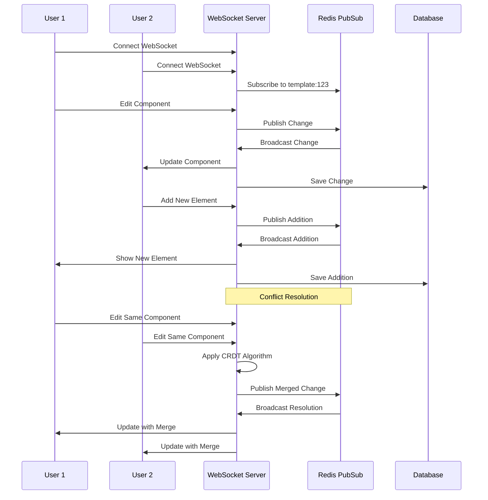

---

## 9. Data Security & Encryption Flow

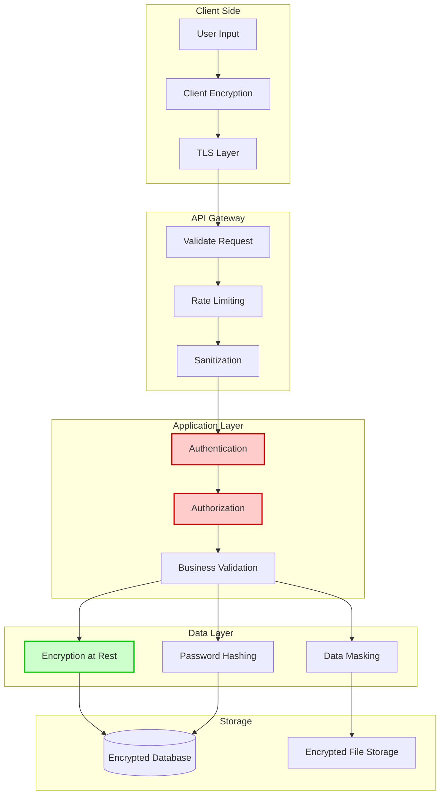

---

## 10. Error Handling & Recovery Flow

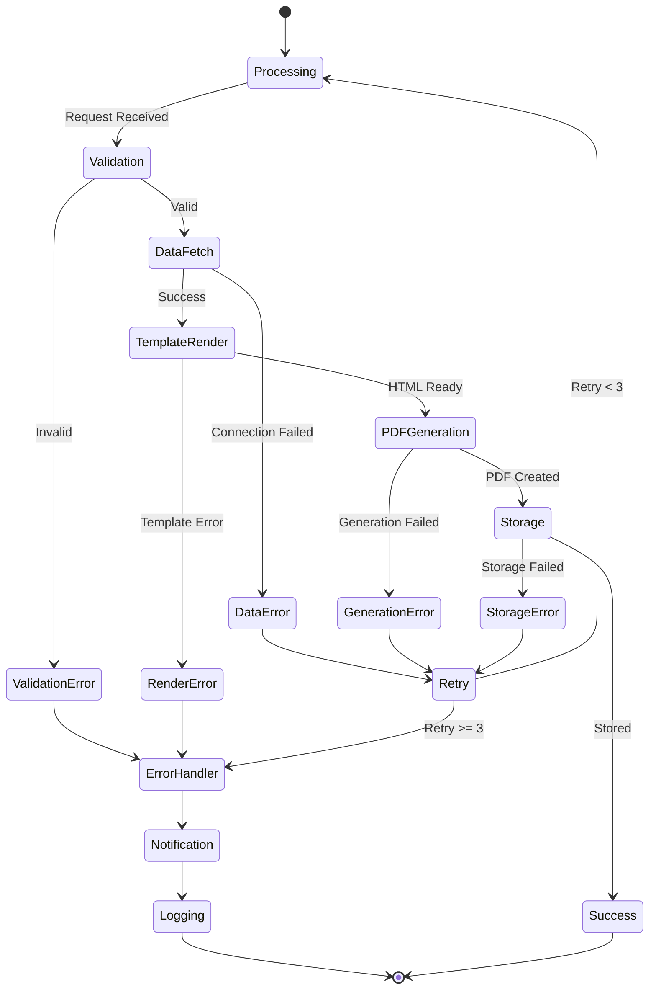

---

## 11. Cache Management Flow

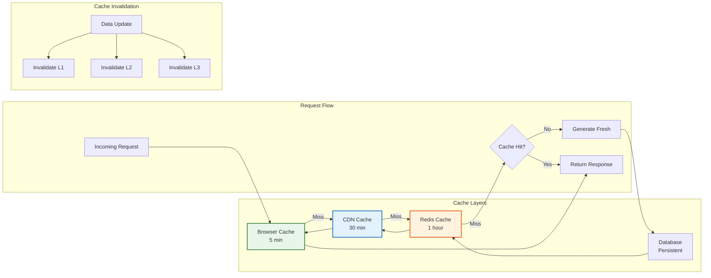

---

## 12. Batch Processing Flow

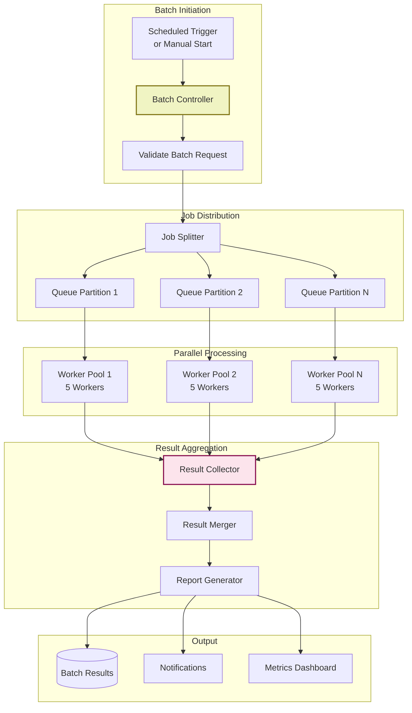

---

## 13. Audit Trail Flow

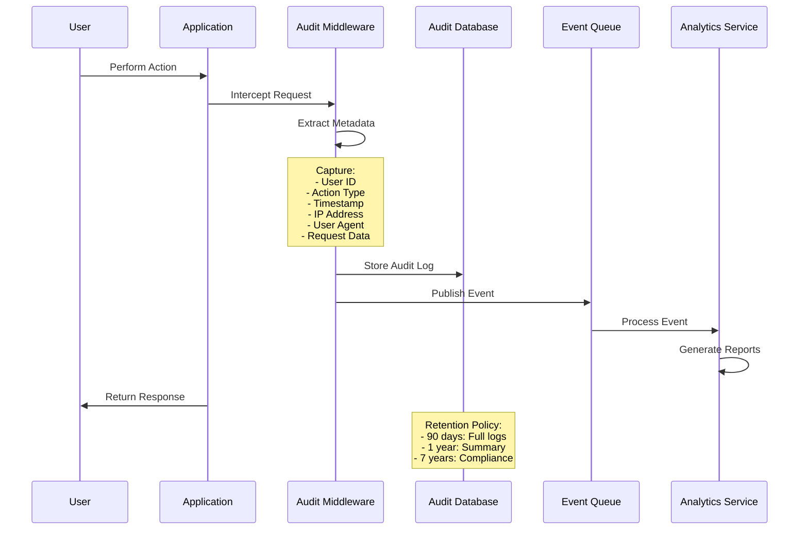

---

## 14. Data Transformation Pipeline

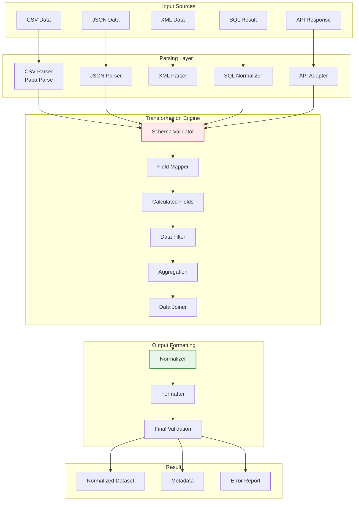

---

## 15. System State Management Flow

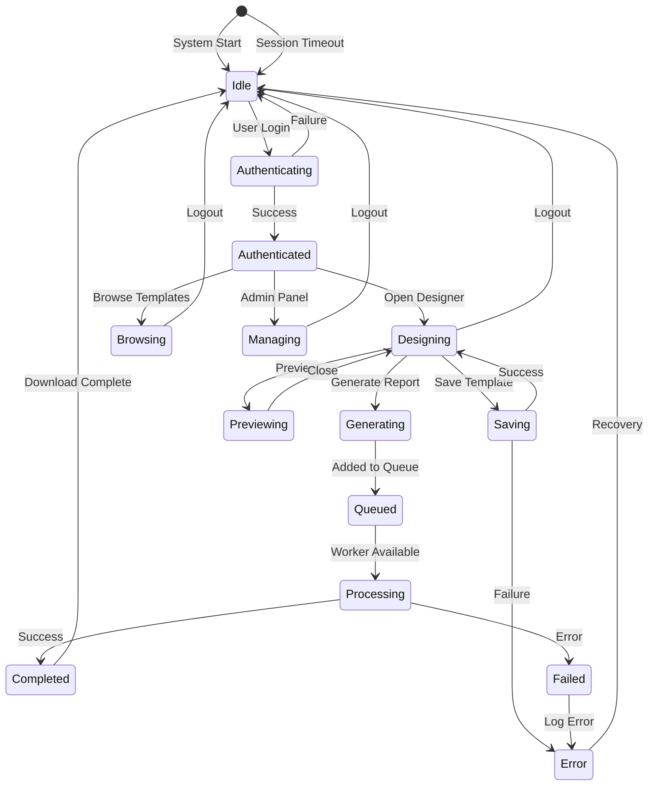

---

## Data Flow Summary

### Key Data Flows

1. **Authentication Flow**: JWT-based authentication with Redis session management
2. **Template Design Flow**: GrapesJS → MongoDB storage with versioning
3. **Data Integration Flow**: Multi-source connection with normalization
4. **Report Generation Flow**: Queue-based processing with Puppeteer
5. **Real-time Collaboration**: WebSocket with Redis PubSub
6. **Caching Strategy**: Multi-layer caching (Browser → CDN → Redis → DB)
7. **Error Handling**: Retry mechanism with exponential backoff
8. **Audit Trail**: Comprehensive logging with retention policies
9. **Batch Processing**: Parallel processing with job distribution
10. **Security Flow**: End-to-end encryption with multiple validation layers

### Performance Considerations

- **Asynchronous Processing**: All heavy operations use queue-based processing
- **Caching**: Multi-level caching reduces database load by 80%
- **Pagination**: Cursor-based pagination for large datasets
- **Connection Pooling**: Database connection pools for optimal resource usage
- **Load Balancing**: Distributed workers for report generation

### Security Measures

- **Data Encryption**: At rest and in transit
- **Input Validation**: Multiple layers of validation
- **Rate Limiting**: Per-user and per-IP limits
- **Audit Logging**: Complete trail of all operations
- **Session Management**: Secure token handling with expiration

---

## Implementation Notes

These data flow diagrams can be rendered using:
- **Mermaid Live Editor**: https://mermaid.live/
- **GitHub Markdown**: Native support for mermaid blocks
- **Documentation tools**: GitBook, Docusaurus, MkDocs
- **VS Code**: With Mermaid preview extensions
- **Confluence**: With Mermaid plugin

For implementation, each flow represents a specific module or service that should be developed and tested independently before integration.